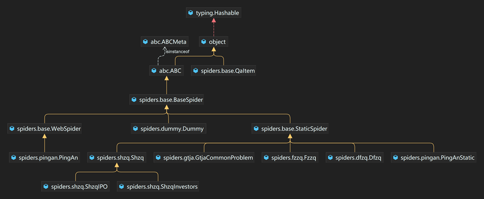
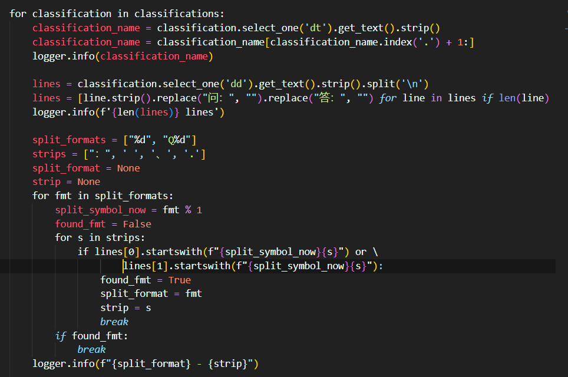
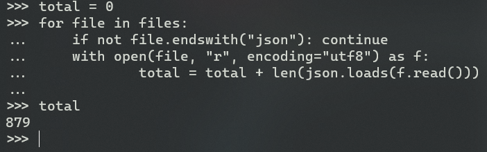

### 金融领域QA问答数据库的构建

#### 引言

由于我们的QA工具暂时应用于金融问答领域，所以我们需要这一特定领域的大量问答资料，然而，当前针对这一特定领域并没有可用的QA问答数据库。针对这一问题，我们在网络上爬取并分析、储存了大量针对金融QA问答文本，形成了一个丰富可用的金融领域QA问答数据库。本章以数据的爬取、处理和清洗、数据统计的顺序，详细介绍这一QA问答数据库的形成过程以及构成特点。

#### 数据的爬取

我们生成的问答数据库数据来源为各大金融网站，包括东方证券·国际（https://www.dfzq.com.hk/main/index/clientService/faq/index.shtml）、东方证券（https://www.dfham.com/service/faq/jiaoyi/index.html）、平安证券（https://stock.pingan.com/static/sbp/helpcenter/index.html）等等接近20个数据源平台。

由于数据源较多，使用手工进行收集不仅效率低下，还会出现格式不兼容不规范、数据难读取等问题，所以我们必须进行程序化自动化的爬取。此外，因为数据源多而数据源格式大不相同，有静态的纯文本HTML网页，也有动态网页所调用的RESTful格式的API，所以使用scrapy等网络爬虫工具爬取反而造成代码无法重用、代码量大、难复现等特点。

为了解决这些问题，我们设计了一套简单而灵活的小数据源爬取系统。

通过数据源分类，我们发现大致有两种数据类型：静态网页和动态网页。通过继承的方式，最大程度地减少代码量，让不同的静态页面能够共用部分代码，方便解析简单而杂的小页面。同时，形成一个统一的 `QaItem`，便于格式化整个问答数据库。

#### 数据的处理和清洗

根据数据源的不同，数据的处理和清洗的难度也不同。对于动态页面的数据，大都只需要通过验证并更改 JSON 格式信息；而对展示良好的静态页面，也会比较明显地区分出问题和对应的答案，从而可以使用 `BeautfulSoup` 等HTML解析库来解析提取出问答数据结构。

而对一些比较老的网页，往往只有一段文本文字，我们需要从这段文字中提取问题和对应的答案。

通过对这些文本的观察，我们发现这些文本中的问题通常以“问”或者“Q”“Q1”等为开头，文本中的答案通常以“答”或者“A”“A1”等为开头，于是我们可以用判断文本内容的方式对整段文本进行切分，完成对纯文本的QA问答格式的抽取。

#### 数据统计

数据按照来源分装于 `.json` 文件中，自动收集的QA总计有879条，再加上手动收集的部分，有接近1000条金融QA问答数据；数据总量为774,144字节。

#### 本章小结

本章针对金融领域QA问答的特点，从网络上近20个网络数据源爬取了近1000条金融领域QA问答数据，数据量总共有774,144字节，能够满足使用需求。

